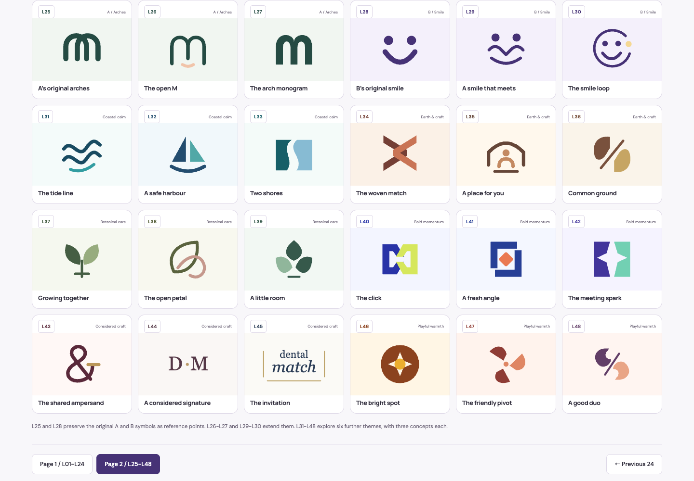
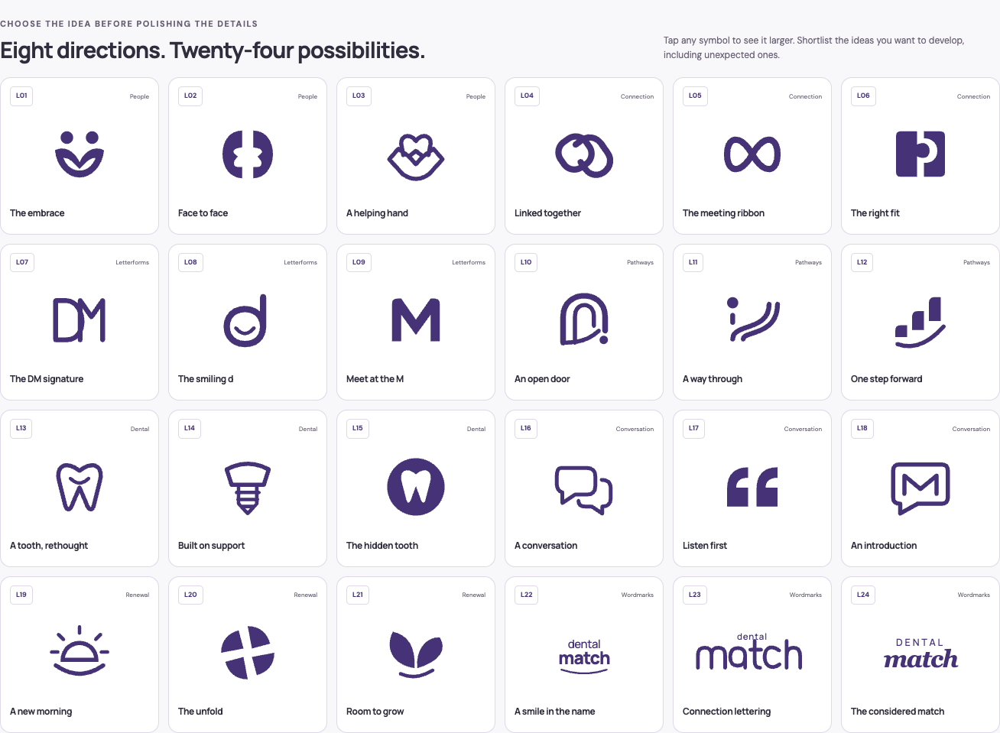
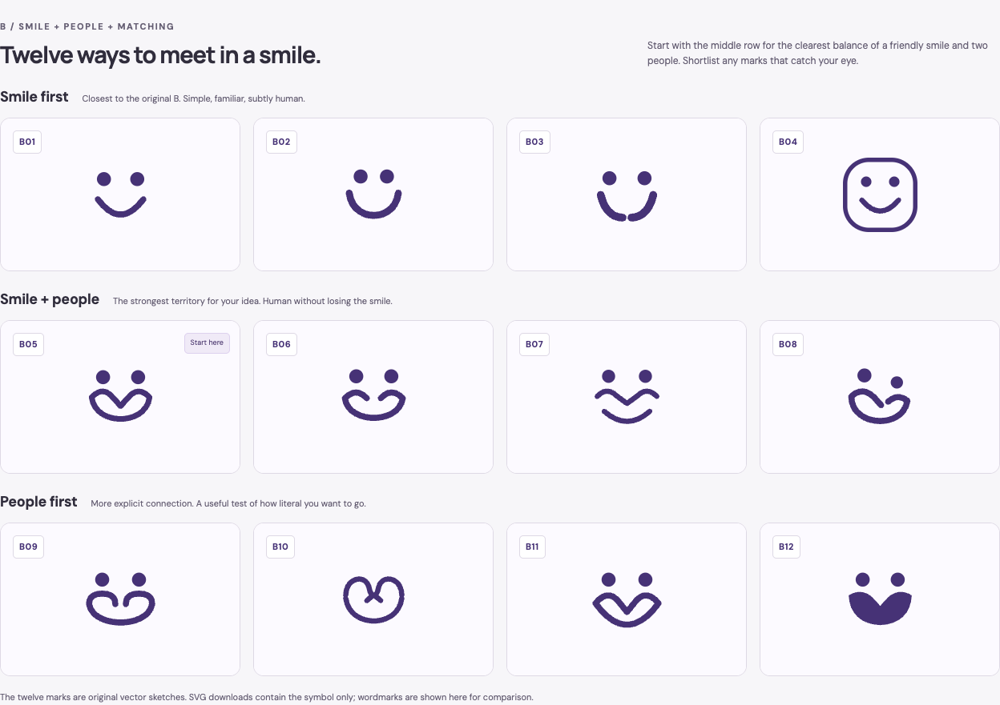

# Dental Match theme explorations

Six visual directions for Dental Match, an Australian clinic matching and patient support business focused on dental implants and major dental treatment.
The concepts explore a reassuring, practical identity for patients facing fear, cost concerns, family responsibilities, shame, inconvenience and uncertainty about their options.

## View the board

The logo exploration now has 48 concepts across two pages, with navigation at the top and bottom of each page.
[View page 2 online](https://agadgil-sap.github.io/dm-themes/dental-match-logo-exploration-page-2.html) for three A arch studies, three B smile studies and eighteen further concepts in six different colour and style themes.
The original A and B symbols are included as reference points in those first six.
Open [dental-match-logo-exploration-page-2.html](dental-match-logo-exploration-page-2.html) for the portable version.



[View page 1 online](https://agadgil-sap.github.io/dm-themes/dental-match-logo-exploration.html) for the original 24 concepts across people, connection, letterforms, pathways, dental motifs, conversation, renewal and wordmarks.
Open [dental-match-logo-exploration.html](dental-match-logo-exploration.html) for the portable version.
Both pages support filters, larger previews, palette comparisons and SVG downloads.
The published pages save a combined shortlist and separate notes for each page in the browser.
Lavish review tabs hold their own selections; queue or copy each shortlist before closing the tab.



The earlier refinement round develops the selected A and B directions, with three variations of each and twelve logo sketches for B.
Open [dental-match-ab-refinements.html](dental-match-ab-refinements.html) to compare them, preview combinations and shortlist favourites.



Download [dental-match-inspiration.html](dental-match-inspiration.html) and open it in a browser.
The portable board includes its reference screenshots, with fonts and styling loaded over the internet.


## The six directions

- **A: Warm reassurance** - forest green, sage and peach with rounded typography.
- **B: Friendly clarity** - plum and lilac with bold, modern typography.
- **C: Quiet confidence** - navy, mist blue and brass with refined serif typography.
- **D: Grounded care** - cocoa, ochre and olive with a sturdy, familiar serif.
- **E: Positive momentum** - coral and apricot with energetic condensed typography.
- **F: Clear guidance** - white, slate and teal with structured, practical typography.

Each direction includes a palette, type pairing, exploratory logo sketch, draft messaging and photography guidance.
A and B are the selected favourites, with the current preference leaning towards B.
The second round explores a smile that also suggests two people meeting or matching.

## Source and exports

The editable source is [.lavish/dental-match-inspiration.html](.lavish/dental-match-inspiration.html).
Its local assets are in [.lavish/assets](.lavish/assets).
The root HTML file is a generated portable export; regenerate it from the source after edits.

```sh
lavish-axi export .lavish/dental-match-inspiration.html --out dental-match-inspiration.html
lavish-axi export .lavish/dental-match-ab-refinements.html --out dental-match-ab-refinements.html
python3 .lavish/assets/logo-exploration/build.py
python3 .lavish/assets/logo-exploration/build.py --page 2
lavish-axi export .lavish/dental-match-logo-exploration.html --out dental-match-logo-exploration.html
lavish-axi export .lavish/dental-match-logo-exploration-page-2.html --out dental-match-logo-exploration-page-2.html
```

The second-round source is [.lavish/dental-match-ab-refinements.html](.lavish/dental-match-ab-refinements.html).
The twelve draft B symbols are available as editable SVGs in [.lavish/assets/logos-b](.lavish/assets/logos-b).

For the logo boards, edit the authored page 1 concepts in [.lavish/assets/logo-exploration/concepts.json](.lavish/assets/logo-exploration/concepts.json), page 2 concepts in [.lavish/assets/logo-exploration/concepts-page-2.json](.lavish/assets/logo-exploration/concepts-page-2.json), or their renderer in [.lavish/assets/logo-exploration/build.py](.lavish/assets/logo-exploration/build.py), then run the build and export commands above.
The HTML boards, SVGs and ZIP bundles are generated outputs.
The draft SVGs are in [.lavish/assets/logo-exploration/svg](.lavish/assets/logo-exploration/svg) and [.lavish/assets/logo-exploration/svg-page-2](.lavish/assets/logo-exploration/svg-page-2).
Each board also provides a download of its 24 SVG sketches.

## Visual references

The board includes reference screenshots from [Tend](https://www.hellotend.com/site/home), [HotDoc](https://english.hotdoc.com.au/) and [Dental 99](https://dental99.com.au/), captured on 2 October 2026.
The Dental Match directions are original explorations.
