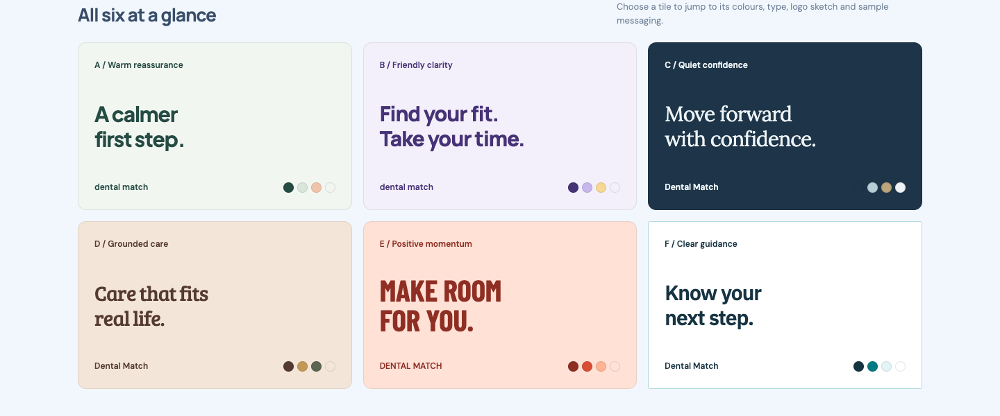

# Dental Match theme explorations

Six visual directions for Dental Match, an Australian clinic matching and patient support business focused on dental implants and major dental treatment.
The concepts explore a reassuring, practical identity for patients facing fear, cost concerns, family responsibilities, shame, inconvenience and uncertainty about their options.

## View the board

Download [dental-match-inspiration.html](dental-match-inspiration.html) and open it in a browser.
The portable board includes its reference screenshots, with fonts and styling loaded over the internet.



## The six directions

- **A: Warm reassurance** - forest green, sage and peach with rounded typography.
- **B: Friendly clarity** - plum and lilac with bold, modern typography.
- **C: Quiet confidence** - navy, mist blue and brass with refined serif typography.
- **D: Grounded care** - cocoa, ochre and olive with a sturdy, familiar serif.
- **E: Positive momentum** - coral and apricot with energetic condensed typography.
- **F: Clear guidance** - white, slate and teal with structured, practical typography.

Each direction includes a palette, type pairing, exploratory logo sketch, draft messaging and photography guidance.
These concepts are awaiting selection and refinement.

## Source and exports

The editable source is [.lavish/dental-match-inspiration.html](.lavish/dental-match-inspiration.html).
Its local assets are in [.lavish/assets](.lavish/assets).
The root HTML file is a generated portable export; regenerate it from the source after edits.

```sh
lavish-axi export .lavish/dental-match-inspiration.html --out dental-match-inspiration.html
```

## Visual references

The board includes reference screenshots from [Tend](https://www.hellotend.com/site/home), [HotDoc](https://english.hotdoc.com.au/) and [Dental 99](https://dental99.com.au/), captured on 2 October 2026.
The Dental Match directions are original explorations.
